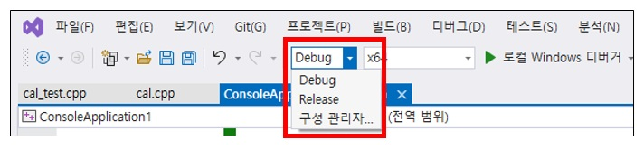
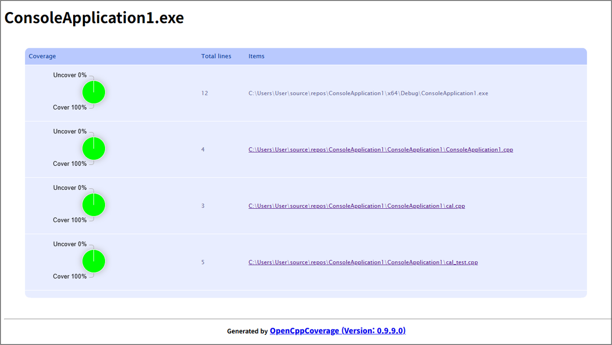
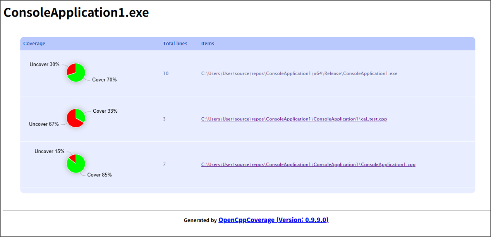

# 차량 조립 프로젝트  

## 평가일정  
1. 종료시간 17:30  
2. 45분 진행 15분 휴식  
3. 점심시간 11:30 ~ 12:30  
4. 전화는 강의장 밖에서  
5. 인터넷 검색 가능  
6. 휴식시간 내 강의장 밖에서만 대화 가능  

## 시험 중 문의사항  
강사에게 아래 이메일로 코드를 보내주세요.  
jaryong.lee@mincoding.co.kr  

## 부정행위  
1. 평가시간동안 강의장 내에서 대화 또는 전화통화  
2. 메신저 / 사내게시판 사용  
3. GPT 등 생성형 AI 사용  
4. 사진촬영 및 평가 문제 유출  
5. 타인의 소스코드와 유사  


## 퇴실  
과제 완료되면 **휴식시간** 에 퇴실 가능  


## 제출 방법  
링크 제출용 공유 스프레드시트는 다음과 같습니다.  

[공유문서](https://docs.google.com/spreadsheets/d/1FBZnkwFsz1SWDbLAh5htrURrukQ5Um43SCpBIN6k6lk/edit?usp=sharing)  


개인 리포지토리를 깃허브에 생성한 후, 다음과 같이 제출합니다.  


`mission1/` 폴더에는 메서드 레벨 리팩토링 코드를 포함합니다. (**단, 유닛테스트는 포함하지 않습니다.**)  
`mission2/` 폴더에는 클래스 레벨 리팩토링 코드를 포함합니다. (**유닛테스트를 포함합니다**) 


`README.md` 에는 다음 사항을 작성해주십시오.  
1. D1 ~ D5 까지 적용 여부 체크리스트  
마크다운에서 테이블 문법을 아신다면 쓰시면 되구요, 모르신다면 간단하게 적어주셔도 무방합니다.  
2. Code Coverage 최종 측정결과 캡쳐화면  
캡쳐화면은 이미지파일이기 때문에, `result.jpg` 등의 형식으로 첨부해 올리시면 됩니다.  


D1 ~ D5 까지 체크리스트에 체크가 된 항목은, 채점자가 수동으로 진행 수준을 평가하도록 하겠습니다.  
만약 체크가 안 된 항목은 오답처리하겠습니다.  
캡쳐 화면이 없는경우는 오답처리합니다.  


## 기타 안내사항  
- 브랜치는 나누지 않고 기본 브랜치 (master or main) 하나로 통일합니다.  
- 하나의 리포지토리에 `/mission1` , `/mission2` , `README.md` , 이미지 파일들을 담습니다.  
- 커밋 기록은 평가 대상이 아닙니다.  
- 리포지토리 이름은 자유입니다.  
- 60 점 이상 패스입니다.  
- D1 ~ D5 가 적용되었다고 해서 만점이 아니며, 적용되지 않았다고 해서 0 점도 아닙니다.  
- 감독관은 C++ 환경 설정만 안내하며, 다른 언어로 수강하신 분들을 위해 세 가지 언어 (C++, Java, Python) 중 어떤 것을 선택해도 무방합니다.  
- 시험 결과를 개별 통보하는지 등의 기타 사항은 CRA 과정 담당자에게 개별 문의 바랍니다.  


## 커버리지 100% 가 잘 안될 경우  

Coverage 100% 는 순수하게 클래스 내의 메서드만 테스트하는 테스트 파일만으로 이루어져야 하며, 실제 프로그램을 테스트해선 안됩니다.  
이를 위해, 다음과 같이 Debug 와 Release 로 분기를 나눌 것을 권장합니다.  

```cpp
// main.cpp
#ifdef _DEBUG

#include "gmock/gmock.h"

int main()
{
	testing::InitGoogleMock();
	return RUN_ALL_TESTS();
}

#else

#include <stdio.h>
#include "cal.cpp"
int main()
{
    Cal cal;
    int a = 1, b = 2;
    char input;

    // 사용자에게 분기 선택 메시지 출력
    printf("에러 경로를 실행하려면 'e'를 입력하세요. 그 외의 입력은 정상 경로를 실행합니다: ");
    input = getchar();

    // 사용자 입력에 따른 분기 처리
    if (input == 'e') {
        // 음수 결과를 유도하여 에러 분기로 들어감
        a = -3;
        b = 1;
    }

    int ret = cal.getSum(a, b);

    if (ret < 0) {
        printf("Error: Negative sum encountered.\n");
    }
    else {
        printf("Result: %d\n", ret);
    }
    return 0;
}

#endif
```

위 코드의 경우, `_DEBUG` 매크로에서 동작되는 코드와, `else` 문에서 실행되는 `_RELEASE` 매크로에서 동작되는 코드로 나뉘어져 있습니다.  

두 개의 매크로를 전환하려면 아래 그림과 같이 전환합니다.  

  

Debug / Release 선택시마다 실행되지 않는 코드 영역이 회색처리되는것을 보실 수 있습니다.  

위 코드는 `cal.cpp` 파일을 참고하며, 코드는 다음과 같습니다.  

```cpp
// cal.cpp

class Cal
{
public:
	int getSum(int a, int b)
	{
		return a + b;
	}
};
```

즉, 현재 Release 모드에선 해당 코드를 가져와 사용하기만 합니다.  

해당 클래스를 테스트하기위한 `cal_test.cpp` 는 다음과 같습니다.  

```cpp
// cal_test.cpp
#include "gmock/gmock.h"
#include "cal.cpp"

TEST(Group, TC1)
{
	Cal cal;

	int ret = cal.getSum(10, 20);

	EXPECT_EQ(30, ret);
}
```

종합해보면, Debug 모드의 목적은 클래스의 모든 메서드를 테스트하기 위한 것이며, Release 모드의 목적은 순수하게 프로그램을 실행하기 위함입니다.  

그렇다면, 커버리지 측정은 어디서 해야 할까요? 당연히 Debug 모드에서, 순수하게 테스트 코드만 동작시켜야 합니다.  
Release 모드에선 파일 입출력, 사용자 입력 등이 흔히 쓰이는데, 이 모든 내용을 테스트하는것은 큰 의미가 없기 때문입니다.  

실제로 Debug 모드와 Release 모드로 각각 빌드 후, 커버리지를 측정해보면 결과는 다음과 같습니다.  

디버그 모드:  


릴리즈 모드:
  


그렇다면, Debug 와 Release 엔 각각 무엇이 담겨있어야 할까요?  

1. Debug 는 클래스의 메서드를 테스트하는 테스트 파일만 담겨져 있어야만 합니다.  
2. Relase 엔 작성한 클래스를 활용하는 코드가 담겨있어야 합니다.  

추가적으로, 입출력을 클래스에 담는 것이 옳은가? 그렇지 않습니다!  

입출력은 Release 에 모두 담겨야 하며, 클래스의 메서드는 값을 입력받아, 결과값을 리턴하는 역할만 해야 합니다.  
즉, 클레스의 메서드에서 사용자 입력을 받거나, 출력을 하면 안됩니다!  